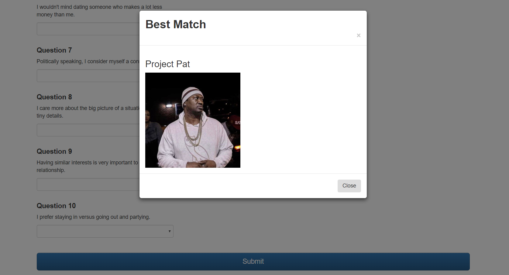

# ExpressJS/Node "Friend Finder" App

[View Live!](http://intense-fortress-12650.herokuapp.com/)

## Brief Description

The **ExpressJS/Node "Friend Finder" App** allows users to take a short, 10-question survey about their personality & then submit these answers, which sends an **AJAX request** to a server that is created using **ExpressJS**, and **"posts"** their results as a **JSON** object to that server. Their answers are then compared to the answers of every other user who has taken the survey, and the existing user who is the best match with the new user is determined. A **Bootstrap modal** then pops up on the survey page, displaying the name & photo of the best match.

## How This Was Achieved

First, I created  a *"server.js"* file, which sets up dependencies for the necessary **NPM packages**, including **Express**, **BodyParser**, and **Path**. The Express server is then activated based on the specified port. Next, the server is pointed to a series of "route" files in other folders within the main directory, which give the server a "map" of how to respond when users visit or request data from various URLs. 

One of these "route" files is *"htmlRoutes.js"*, which contains **Express** server code that determines which page of the application is displayed for the user, depending on the URL that the user types into his/her browser. One possible page option is the Home page, which just contains basic information on what the app does and provides a link to get to the survey. The Survey page is the second possible option & it displays the actual survey for the user to take.

The other "route" file is *"apiRoutes.js"*, which contains the **Express** server code for the actual **AJAX requests** that happen during this app's usage. This page is the meat of the FriendFinder app. First, it sets up a *"Get"* request for displaying the raw JSON information for all the users that have taken the survey. Next, the apiRoutes page defines what happens when a user's information is actually posted to the server.

When a user's information hits the server, the app uses a **For loop** to run through all the other users on the server and find the difference between each item in the new user's scores array with the corresponding item in each of the other users' scores arrays. These scores arrays contain 10 numbers, each number representing the users' answers to the various survey questions. These survey questions allow the user to select a **number from 1 to 5** to indicate their level of agreement or disagreement with the question. Once the difference for each question is calculated, all of these differences are added together to find the new user's *Total Difference* as compared to each of the other users. Some **JavaScript** code is run to determine which existing user has the least Total Difference with the new user, and this user's information is sent as a JSON object to the Survey page. The new user's information is then added to the array of existing users.

Meanwhile, the Survey page contains the code that actually sends the new user's information to the server. When the submit button is clicked on this page, a JSON object is created containing the values of his/her answers, and this data is sent as a **Post request** to the server. Once the server receives this data, the code in the apiRoutes file determines the best match and sends the data for the "best match" back to the Survey page, as described in the previous paragraph. Once the survey page receives the "best match" data, it dynamically updates the text within the popup **Bootstrap modal** to contain the "best match"'s name and photo. All of these actions that are triggered by the submit button take place very fast, meaning that as soon as the submit button is clicked, users see a modal pop up with the name and photo of their "best match".  

The file called *"friends.js"* is what contains the array of users, which initially only has one sample user. This array is exported so that it can be used by other files. 